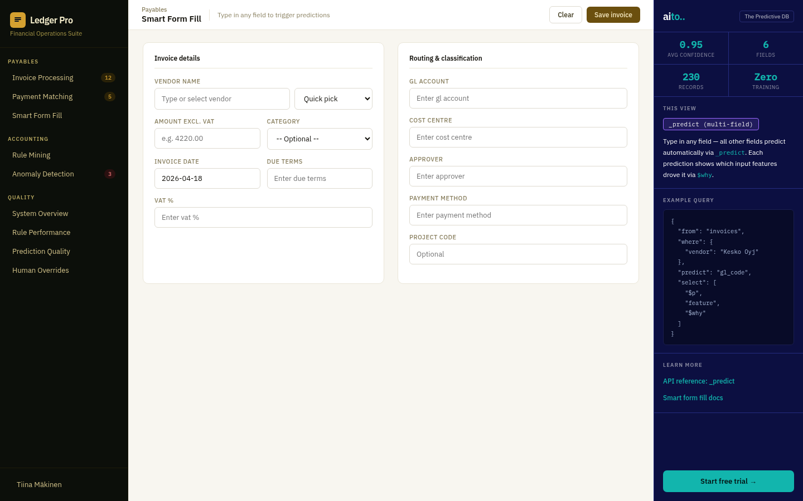
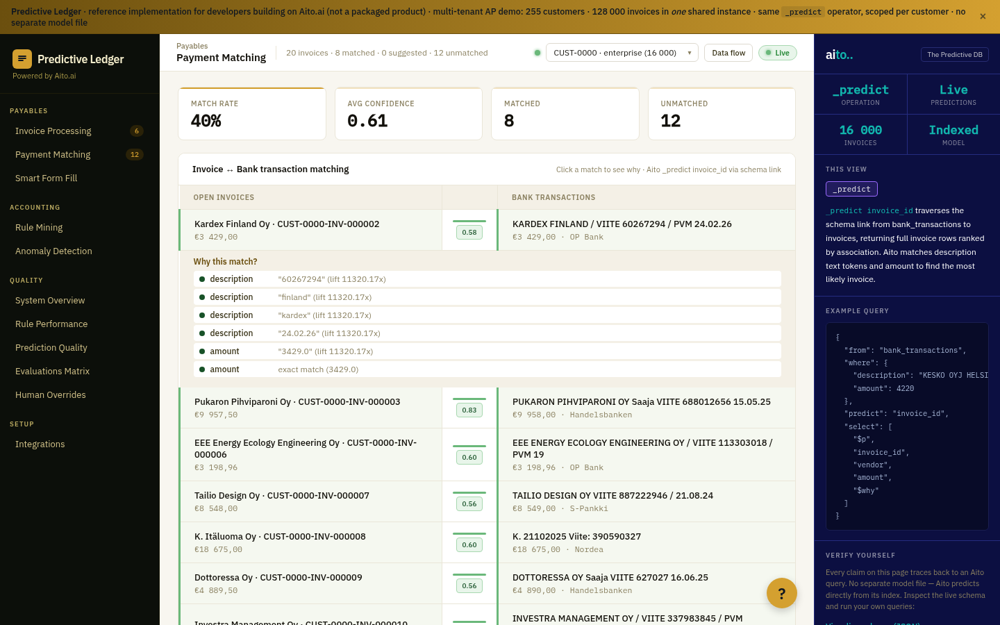
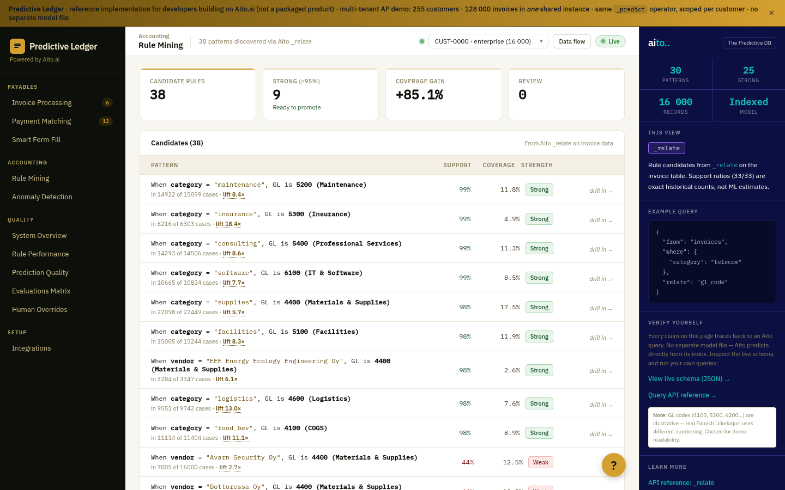
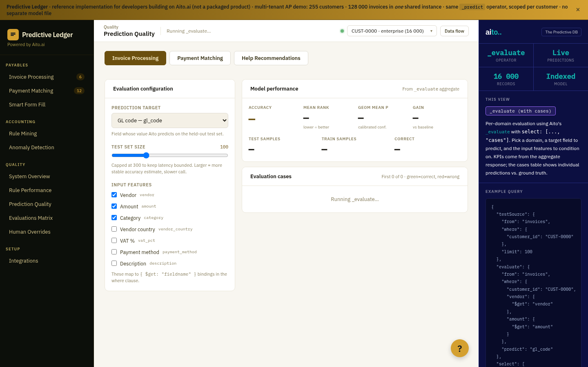
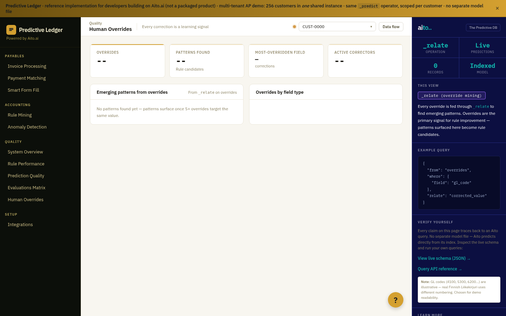

# Predictive Ledger — Multi-tenant accounting on Aito.ai

> A working reference implementation showing [Aito.ai](https://aito.ai)
> as the prediction engine behind a SaaS accounting product.
> 255 customer companies, 128K invoices, one shared Aito instance,
> per-customer predictions via `customer_id` in the where clause.
> No model training. No retraining. Add a row, the next prediction
> reflects it.

[](LICENSE)
[](https://aito.ai)
[](https://github.com/AitoDotAI/aito-demo)

Companion to [aito-demo](https://github.com/AitoDotAI/aito-demo) (the
e-commerce reference). That one shows recommend / autocomplete /
product analytics for a grocery store. This one shows GL coding,
approver routing, payment matching, anomaly detection, override
mining, and CTR-ranked help — every operator the same as in
aito-demo, scaled out per-tenant.


## Try it instantly (no signup)

```bash
# Predict the GL code for a Telia invoice belonging to one customer
curl -X POST https://shared.aito.ai/db/aito-accounting-demo/api/v1/_predict \
  -H "X-API-Key: <your-key>" \
  -H "Content-Type: application/json" \
  -d '{
    "from": "invoices",
    "where": {
      "customer_id": "CUST-0000",
      "vendor": "Telia Finland Oyj",
      "amount": 890.50
    },
    "predict": "gl_code",
    "select": ["$p", "feature", "$why"]
  }'
```

Same query with a different `customer_id` returns a different
prediction, because each customer's history is what conditions the
probability.

## What I built

### 1. 🧾 Invoice processing — GL code + approver predictions


```json
{
  "from": "invoices",
  "where": {
    "customer_id": "CUST-0000",
    "vendor": "Kesko Oyj",
    "amount": 4220,
    "category": "supplies",
    "description": "Office supplies Q1 - bulk order"
  },
  "predict": "gl_code",
  "select": ["$p", "feature", {"$why": {"highlight": {"posPreTag": "<mark>", "posPostTag": "</mark>"}}}]
}
```

[→ Implementation](src/invoice_service.py) | [Use case guide](docs/use-cases/01-invoice-processing.md) | [ADR](docs/adr/0004-invoice-processing-live.md)

### 2. 🪄 Smart Form Fill — multi-field prediction



Type any field, the rest predict. Picks vendor → fills GL, approver,
cost centre, payment method, due terms, VAT %. Each prediction shows
top-3 alternatives + `$why` factors with text-token highlighting.

```json
{
  "from": "invoices",
  "where": {
    "customer_id": "CUST-0000",
    "vendor": "Telia Finland Oyj"
  },
  "predict": "approver",
  "select": ["$p", "feature", "$why"]
}
```

[→ Implementation](src/formfill_service.py) | [Use case guide](docs/use-cases/02-smart-form-fill.md) | [ADR](docs/adr/0005-smart-form-fill.md)

### 3. 🏦 Payment matching — bank txn ↔ invoice via schema link



```json
{
  "from": "bank_transactions",
  "where": {
    "customer_id": "CUST-0000",
    "description": "OP /VENDOR/ TELIA FINLAND OYJ /VIITE/ 12345",
    "amount": 890.50
  },
  "predict": "invoice_id",
  "select": ["$p", "invoice_id", "vendor", "amount", "$why"]
}
```

The `invoice_id` link in the bank_transactions schema lets `_predict`
return the linked invoice row — no second query, no manual join.

[→ Implementation](src/matching_service.py) | [Use case guide](docs/use-cases/03-payment-matching.md) | [ADR](docs/adr/0007-payment-matching.md)

### 4. 🧠 Rule mining — discover patterns + drill into compounds



```json
{
  "from": "invoices",
  "where": {"customer_id": "CUST-0000", "category": "telecom"},
  "relate": "gl_code"
}
```

Each candidate row expands into a chained `_relate` for compound
patterns: `category=telecom & gl_code=6200 → approver=Timo Järvinen
(701/8000, 15.8× lift)`. The poor-man's pattern proposition.

[→ Implementation](src/rulemining_service.py) | [Use case guide](docs/use-cases/04-rule-mining.md) | [ADR](docs/adr/0006-rule-mining.md)

### 5. 🚨 Anomaly detection — inverse prediction


For each invoice, `_predict` the GL code that *should* apply. If the
ground-truth GL is not in the top-3 of predictions, flag it. Low
confidence on a normally-predictable field = anomaly.

```json
{
  "from": "invoices",
  "where": {"customer_id": "CUST-0000", "vendor": "Telia", "amount": 50000},
  "predict": "gl_code",
  "select": ["$p", "feature"]
}
```

[→ Implementation](src/anomaly_service.py) | [Use case guide](docs/use-cases/05-anomaly-detection.md) | [ADR](docs/adr/0008-anomaly-detection.md)

### 6. 💡 Help drawer — CTR-ranked articles via `_recommend`

The same recommendation pattern aito-demo uses for product
suggestions, applied to in-app help. Every shown article is an
impression; every click trains the next ranking.

```json
{
  "from": "help_impressions",
  "where": {"customer_id": "CUST-0000", "page": "/invoices"},
  "recommend": "article_id",
  "goal": {"clicked": true},
  "limit": 5
}
```

"Users who read this also read" chains the session via
`prev_article_id`:

```json
{
  "from": "help_impressions",
  "where": {"customer_id": "CUST-0000", "prev_article_id": "ART-INVOICES-101"},
  "recommend": "article_id",
  "goal": {"clicked": true}
}
```

[→ Implementation](src/help_service.py) | [Use case guide](docs/use-cases/06-help-recommendations.md) | [ADR](docs/adr/0013-help-drawer-recommend.md)

### 7. 📊 Quality dashboard — `_evaluate` for real accuracy



Pick a domain (Invoice / Payment / Help), a target field, the input
features to condition on. The page runs `_evaluate` with `select:
[..., "cases"]` against a held-out test sample and renders a
green/red diff table per case, with KPIs vs the always-predict-
majority baseline.

```json
{
  "testSource": {"from": "invoices", "where": {"customer_id": "CUST-0000"}, "limit": 100},
  "evaluate": {
    "from": "invoices",
    "where": {
      "customer_id": "CUST-0000",
      "vendor": {"$get": "vendor"},
      "amount": {"$get": "amount"},
      "category": {"$get": "category"}
    },
    "predict": "gl_code"
  },
  "select": ["accuracy", "baseAccuracy", "geomMeanP", "testSamples", "cases"]
}
```

[→ Implementation](src/evaluation_service.py) | [Use case guide](docs/use-cases/07-quality-dashboard.md) | [ADR](docs/adr/0009-quality-dashboard.md)

### 8. ✋ Human overrides — input → output rules from corrections



Two-pass `_relate` on the overrides table. Pass 1 finds the most-
corrected target values; pass 2 walks the schema link
(`overrides.invoice_id.vendor`) to surface the input that drove the
correction:

```json
{
  "from": "overrides",
  "where": {"customer_id": "CUST-0000", "field": "gl_code", "corrected_value": "5400"},
  "relate": "invoice_id.vendor"
}
```

Output rows have the same `input → output` shape as Rule Mining, so
they can be promoted directly.

[→ Implementation](src/quality_service.py) | [Use case guide](docs/use-cases/08-human-overrides.md)

### 9. 🏢 Multi-tenancy — single Aito table, 255 tenants

```json
{
  "from": "invoices",
  "where": {"customer_id": "CUST-0000", "vendor": "Telia Finland Oyj"},
  "predict": "gl_code"
}
```

Every endpoint adds `customer_id` to the `where` clause. Same vendor,
different customer → different prediction, because the conditional
probability is computed only over rows that match the where filter.
No per-tenant Aito instance, no per-tenant table, no isolation
layer beyond the index.

[→ Implementation](src/precomputed.py) | [Use case guide](docs/use-cases/multi-tenant-accounting.md) | [ADR](docs/adr/0012-single-table-multitenancy.md)

## Quick start

```bash
git clone <repo-url>
cd aito-accounting-demo

# 1. Configure Aito credentials
cp .env.example .env
# Edit .env with your AITO_API_URL and AITO_API_KEY

# 2. Install Python deps (uv: https://docs.astral.sh/uv/)
uv sync

# 3. Fetch ~1400 real Finnish companies from PRH (one-time, ~2 min)
./do fetch-companies

# 4. Generate fixtures (medium = 128K invoices, recommended)
./do generate-data --medium

# 5. Upload to Aito (creates tables, batches inserts, optimizes)
./do reset-data

# 6. (Recommended) Pre-compute every read-only view's JSON
#    Hosted demos serve from disk in <50 ms; dev can skip this.
./do precompute --workers 2 --lite-threshold 1500

# 7. Build the frontend and start the server
./do frontend-build
./do dev
# Open http://localhost:8200
```

The Next.js frontend is served from FastAPI on `localhost:8200` —
single port, no CORS issues.

**Performance modes:**
- **Precomputed** (`./do precompute` ran): all read views serve from
  `data/precomputed/{customer_id}/*.json` in <50 ms; only Form Fill
  hits Aito at runtime.
- **Live** (no precompute): read endpoints call Aito with L1
  in-memory + L2 `cache_entries` table caching. First request per
  customer takes ~15 s, then cached.

Deploying to Azure Container Apps: see
[`docs/deploy-azure.md`](docs/deploy-azure.md). One-shot
`./do azure-deploy` after a one-time RG/ACR/Container App setup.

## Multi-tenancy at a glance

```
┌─ customers (255) ───────────────────────────────────┐
│  CUST-0000   enterprise   16,000 invoices           │
│  CUST-0001   enterprise    8,000 invoices           │
│  ...         large/midmarket/small tiers            │
│  CUST-0254   small           125 invoices ← cold    │
└─────────────────────────────────────────────────────┘
                       │ customer_id link
                       ▼
┌─ invoices (128,000) ─── employees ─── corporate_entities ─┐
│   bank_transactions (~68,000)        overrides (~7,500)   │
│   help_articles (120)              help_impressions (14k) │
└──────────────────────────────────────────────────────────-┘
```

Geometric size distribution (3 enterprise / 12 large / 48 midmarket
/ 192 small). Same demo proves both ends of the data spectrum: top
customer with 16K invoices shows 99%+ accuracy; smallest customer
with 125 invoices still produces useful predictions, with honest
low confidence on novel vendors.

## Aito operators used

| Operator | What it does | Used in |
|----------|--------------|---------|
| `_predict` | Predict a field value from context | Invoice processing, Form Fill, Anomaly detection, Matching |
| `_relate` | Discover statistical patterns with support and lift | Rule mining, override analysis, mined rules per customer, sub-pattern drill |
| `_recommend` | Goal-oriented ranking over an impressions table | Help drawer (CTR ranking) and "users who read this also read" |
| `_evaluate` | Cross-validation accuracy on a held-out sample | Quality / Predictions matrix |
| `_search` | Retrieve records | Aggregate metrics, customer/vendor lookup |

Measured server work on this dataset (warm connection, idle Aito):
`_search` 20 hits ≈ 22 ms, `_predict` ≈ 60 ms, `_relate` ≈ 17 ms,
`_evaluate` 50 samples ≈ 8 s. Network round-trip to `shared.aito.ai`
adds ~63 ms.

## Project structure

```
├── frontend/                    # Next.js (App Router, static export)
│   ├── app/                     # 9 views: invoices, formfill, matching,
│   │                            #   rulemining, anomalies, quality/{4}
│   ├── components/shell/        # Nav, TopBar, AitoPanel, CustomerSelector
│   ├── components/prediction/   # PredictedField, PredictionBadge, WhyTooltip
│   └── lib/                     # customer-context, demo-time, api
├── src/
│   ├── app.py                   # FastAPI endpoints (all customer-scoped)
│   ├── aito_client.py           # Aito REST client
│   ├── invoice_service.py       # Predict GL + approver; rules optional
│   ├── formfill_service.py      # Multi-field predict + predict_template
│   ├── rulemining_service.py    # Pattern discovery via _relate
│   ├── matching_service.py      # _predict invoice_id via schema link
│   ├── anomaly_service.py       # Inverse prediction, clustered by reason
│   ├── help_service.py          # _recommend for help articles
│   ├── quality_service.py       # mine_rules, _evaluate, override mining
│   ├── evaluation_service.py    # /quality/predictions evaluation matrix
│   ├── precomputed.py           # Read precomputed JSON or fall through
│   ├── cache.py                 # 2-layer cache: dict L1 + Aito-table L2
│   ├── date_window.py           # Frozen demo "today" (2026-04-30)
│   └── data_loader.py           # Schema + batch upload + optimize
├── tests/                       # 85 unit tests (pytest, httpx mocks)
├── book/                        # Booktest snapshots — live Aito sanity
├── data/
│   ├── fetch_companies.py       # PRH YTJ API → corporate_entities
│   ├── generate_fixtures.py     # 255 customers, geometric series
│   ├── precompute_predictions.py# Per-customer JSON for hosted demo
│   └── (gitignored) invoices.json, customers.json, ...
├── docs/
│   ├── use-cases/               # One .md per major feature
│   ├── adr/                     # Architecture Decision Records
│   ├── aito-cheatsheet.md       # Verified Aito query patterns
│   ├── demo-script.md           # 5-minute walkthrough
│   └── deploy-azure.md          # Container Apps deployment
├── Dockerfile                   # Multi-stage: Node build → Python runtime
├── do                           # Task runner (./do help)
└── pyproject.toml               # Python deps (uv)
```

## Available commands

```
Data pipeline:
  ./do fetch-companies     Download Finnish companies from PRH YTJ API
  ./do generate-data       Generate fixtures (--small / --medium / default 1M)
  ./do load-data           Upload fixtures to Aito (and optimize tables)
  ./do reset-data          Drop all tables and reload from fixtures
  ./do precompute          Pre-compute predictions for hosted demo

Development:
  ./do dev                 Start the backend API server (port 8200)
  ./do frontend-dev        Start Next.js dev server (port 3000)
  ./do frontend-build      Build Next.js static export
  ./do screenshots         Capture screenshots of all views
  ./do demo                Open the demo in browser

Testing:
  ./do test                Unit tests (pytest, 85 tests)
  ./do book                Booktest snapshots (live Aito)

Deployment:
  ./do docker-build        Build the deployable image
  ./do docker-run          Run it locally on port 8200
  ./do azure-deploy        Push to ACR + update Container App
```

## Architecture decisions

| ADR | Decision |
|-----|----------|
| [0001](docs/adr/0001-project-foundation.md) | Project scaffold, tooling, initial demo |
| [0002](docs/adr/0002-python-backend-aito-client.md) | Python backend with Aito client library |
| [0003](docs/adr/0003-sample-dataset-loader.md) | Sample dataset and data loader |
| [0004](docs/adr/0004-invoice-processing-live.md) | Invoice Processing with live predictions |
| [0005](docs/adr/0005-smart-form-fill.md) | Smart Form Fill — multi-field prediction |
| [0006](docs/adr/0006-rule-mining.md) | Rule Mining with `_relate` |
| [0007](docs/adr/0007-payment-matching.md) | Payment Matching with `_predict invoice_id` |
| [0008](docs/adr/0008-anomaly-detection.md) | Anomaly Detection — inverse prediction |
| [0009](docs/adr/0009-quality-dashboard.md) | Quality Dashboard — metrics and feedback loop |
| [0010](docs/adr/0010-readme-polish.md) | README and demo-script polish |
| [0011](docs/adr/0011-precomputed-views.md) | Precomputed JSON for hosted demo |
| [0012](docs/adr/0012-single-table-multitenancy.md) | Single-table multi-tenancy |
| [0013](docs/adr/0013-help-drawer-recommend.md) | Help drawer ranked by `_recommend` |

## Learn more

- [Aito.ai documentation](https://aito.ai/docs)
- [Aito query cheatsheet](docs/aito-cheatsheet.md) — verified patterns used in this project
- [Demo walkthrough](docs/demo-script.md) — step-by-step guide
- [aito-demo](https://github.com/AitoDotAI/aito-demo) — the companion e-commerce reference
- [PRH YTJ API](https://avoindata.prh.fi/fi/ytj/swagger-ui) — Finnish company registry, source of vendor data
