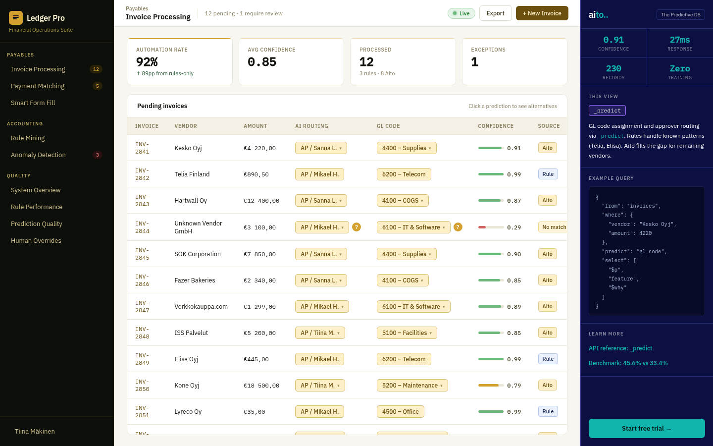

# Invoice Processing — GL coding + approver routing



*Per-customer GL code and approver predictions on a 128K-invoice
multi-tenant dataset. Click any prediction for top-3 alternatives
and `$why` factors with text-token highlighting.*

**Companion to [aito-demo's invoice processing](https://github.com/AitoDotAI/aito-demo/blob/main/docs/use-cases/08-invoice-processing.md)** — same `_predict` operator, applied per-tenant
via a `customer_id` filter so 255 customers share the same Aito
instance.

## Overview

In a SaaS accounts-payable workflow, every incoming invoice has to
be classified (which general-ledger account does this expense belong
to?) and routed (who approves it?). Hand-coded rules cover the
high-frequency vendors but miss the long tail; a per-tenant model
costs ops effort the SaaS provider doesn't want to pay.

This view shows what Aito does instead: one shared `invoices` table,
every prediction scoped per customer via `where: {customer_id, ...}`.
Top-tier vendors collapse to deterministic mined rules (support ≥ 0.95);
everything else falls back to `_predict`.

## How it works

### The data flow

```
Incoming invoice
  vendor, amount, category, description, vendor_country, ...
                   │
                   ▼
   ┌─────────────────────────────┐
   │ Mined rules (per-customer)  │  source: rule
   │ vendor → gl_code, support   │  confidence: 0.99
   │   ratio ≥ 0.95              │
   └─────────────────────────────┘
                   │ no rule matches
                   ▼
   ┌─────────────────────────────┐
   │ _predict gl_code            │  source: aito (if p ≥ 0.85)
   │ where: {                    │  source: review (if p < 0.85)
   │   customer_id, vendor,      │
   │   amount, category,         │
   │   description }             │
   └─────────────────────────────┘
```

### The query

```python
# src/invoice_service.py — predict_invoice()
where = {"vendor": vendor, "amount": amount}
if "customer_id" in invoice:
    where["customer_id"] = invoice["customer_id"]
if "category" in invoice:
    where["category"] = invoice["category"]
if invoice.get("description"):
    where["description"] = invoice["description"]   # Text field

gl_result = client.predict("invoices", where, "gl_code")
approver_result = client.predict("invoices", where, "approver")
```

The `select` requested in the underlying client wraps `$why` with
`highlight` so Aito returns the matched text tokens already wrapped
in `<mark>` tags:

```python
"select": [
    "$p",
    "feature",
    {"$why": {"highlight": {"posPreTag": "<mark>", "posPostTag": "</mark>"}}},
]
```

### `$why` rendering

Each top-level factor in the `$why` tree is one card:

- `type: "baseP"` → "Base probability" card (the prior rate of the
  predicted value)
- `type: "relatedPropositionLift"` → "Pattern match" card with the
  conjunction of propositions and a `× 2.0` multiplier

For a factor on a Text field like `description`, the `highlight`
array names which tokens matched:

```json
{
  "type": "relatedPropositionLift",
  "value": 2.0,
  "proposition": {
    "$and": [
      {"description": {"$match": "monthly"}},
      {"category": {"$has": "telecom"}}
    ]
  },
  "highlight": [
    {"field": "invoices.description", "highlight": "<mark>Monthly</mark> mobile subscription"}
  ]
}
```

The frontend (`InvoiceDetail.tsx → WhyCards`) renders the highlight
HTML directly. A calculation summary at the bottom shows
`base × lift1 × lift2 = final` so the user sees the math.

## Multi-tenancy

Same vendor in two customers' history yields *different*
predictions:

```python
client.predict("invoices",
    {"customer_id": "CUST-0000", "vendor": "Telia Finland"},
    "gl_code")
# → 6200 Telecom (CUST-0000 routes telco to Telecom)

client.predict("invoices",
    {"customer_id": "CUST-0042", "vendor": "Telia Finland"},
    "gl_code")
# → 4500 Office Expenses (CUST-0042 routes telco to Office)
```

Aito's index treats `customer_id` as just another conditioning
variable — adding it to `where` reduces the row set the conditional
probability is computed over. No per-tenant model.

## Performance

Measured on 128K-invoice dataset (warm connection, idle Aito):
- `_predict gl_code` ≈ 60 ms server work + 63 ms network = ~120 ms
- `_predict approver` runs in parallel with `gl_code`, same timing
- Per-customer mined-rule lookup (`mine_rules_for_customer`) cached
  for 30 min in `cache_entries`

For hosted demos the entire view's JSON is precomputed once at
build time (see [ADR 0011](../adr/0011-precomputed-views.md)) so
the browser-perceived latency is <50 ms.

## Out of scope

- **Live document OCR.** The demo assumes the invoice has been
  parsed; predictions condition on already-extracted fields. A real
  product would chain OCR + `_predict` in the ingest pipeline.
- **User-level audit.** `prediction_log` records the predicted vs.
  accepted value per submission, but no UI surfaces a per-user
  audit trail.
