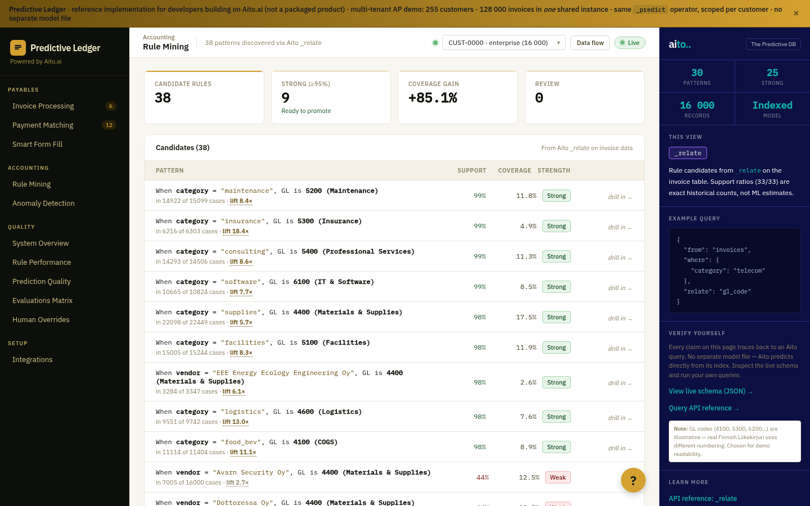

# Rule mining — discover multi-field conjunction rules



*Run `_relate` with `$patterns` over each customer's invoice history to
discover the AND-rules a human would write — `vendor X AND category Y →
GL Z` — server-side, one call per GL code.*

**Companion to [aito-demo's `_relate` use case](https://github.com/AitoDotAI/aito-demo/blob/main/docs/use-cases/07-data-analytics.md)** —
same operator, applied to per-tenant rule discovery.

## Overview

Mined rules capture the high-precision routing patterns ("vendor X with
category Y always books to GL Z") so the production system can
short-circuit the live `_predict` call. `$patterns` mines the
conjunctions directly and returns each rule's exact support (992 / 1006)
and lift, ready to inspect and promote.

This supersedes the earlier single-field miner (ADR 0006), which scored
one feature at a time and faked compound rules by chaining `_relate`
calls — the "poor man's pattern proposition." Aito now has the real
thing.

## How it works

### Inputs in, one rule set per output

We mine rules for each *output* an AP clerk codes — `gl_code` and
`approver` — from **inputs only**: fields known when an invoice arrives.
An output is never a candidate clause (see "No leakage" below).

```python
# src/rulemining_service.py
CANDIDATE_FIELDS = ["vendor", "category", "vendor_country", "amount_band"]
TARGET_FIELDS    = ["gl_code", "approver"]

# For each target field, for each of its frequent values:
result = client.relate_patterns(
    "invoices",
    target={target_field: target_value},      # e.g. {"gl_code": "1600"}
    candidate_fields=CANDIDATE_FIELDS,         # inputs only
    where_filter={"customer_id": customer_id},
    k=8,        # $related focus cap
    limit=6,
)
# Each hit's `related` is a ready-to-reuse $and proposition of inputs:
#   {"$and": [{"category": {"$has": "it_equipment"}},
#             {"amount_band": {"$has": "large"}}]}
# (fs/lift are estimates — exact support is recomputed below.)
```

`$patterns` mines AND-conjunctions of the candidate inputs that predict
the target value. `$related` narrows the inputs to the `k` most related
to the target *before* mining — the cost/latency knob.

### No leakage — inputs vs outputs

`approver`, `cost_centre`, and `gl_code` are *assigned during* coding and
approval; they aren't known when an invoice arrives. Conditioning a rule
on one of them (`approver=X → gl_code=Y`) produces a rule that can't fire
at routing time — leakage. So candidates are restricted to intake inputs,
and each output is mined as its own target. The numeric `amount` is
ignored by `$patterns`, so the data carries a categorical `amount_band`
(small / medium / large) — that's what lets amount-conditional rules
(capitalization, approval escalation) be discovered.

### Discovery, then exact counts

`$patterns`' `fs` are smoothed model **estimates** — fractional, and
rounded to a deterministic "100%" when the data has exceptions. Printed
as support, they contradict the exact-search drill-down. So the service
uses `$patterns` only to discover the conjunctions, then prices each with
exact `_search` `limit:0` counts (all scoped to the customer):

- **Precision** = `count(clauses & GL) / count(clauses)` — of invoices
  matching the rule, the share booked to this GL. ≥ 95% → "strong".
- **Coverage** = `count(clauses & GL) / count(GL)` — of this GL's
  invoices, the share this rule explains.
- **Lift** = `precision / (count(GL) / count(scope))` — vs. base rate.

Because these are the same exact matches the drill-down lists, "815 of
831" agrees with the invoices shown there — and the demo's "exact
counts, not ML estimates" claim holds. Discovery asserts the response
`condition` is the GL target, so conjunctions aren't mined against the
wrong thing.

### Multi-tenancy: nested `from`, not a `where` filter

Scoping to a customer goes in a nested `from`
(`{"from": "invoices", "where": {"customer_id": …}}`), **not** the
`where`. Merging `customer_id` into the `where` breaks `$patterns`: the
linked `customer_id` becomes the condition and the support counts come
back over the global table, not the tenant. (Verified live — see ADR
0014 and the cheatsheet.)

## Demo flow

1. Page loads with the discovered conjunction rules ranked by support ×
   coverage — most are multi-field (`approver="…" AND category="…"`).
2. Click a row (or "view invoices →") → modal opens with the actual
   invoices the rule fires on, marked green/red by whether the rule
   would book them correctly.
3. Click "promote" (production) → rule lands in the rules table for the
   live prediction path to short-circuit.

## Aito features used

- **`_relate` + `$patterns`** — server-side conjunction rule mining.
- **`$related`** — top-k candidate narrowing; the cost/relevance knob.
- **Nested `from`** — tenant scoping that keeps the stats per-customer.
- **Support / lift / counts** — exact, computed at index time, not ML
  estimates.

## Performance

- One pattern-mining call ≈ 9–11 s server-side at 128 k rows — heavier
  than a single-field `_relate`, so mining runs on the precompute /
  warm-cache path, never synchronously in a request.
- `$related`'s `k` bounds the mining focus; smaller `k` trades breadth
  for speed.

## Out of scope

- **Auto-promote.** A real product would promote candidates with
  precision ≥ 0.99 over a stable window. The demo leaves promotion
  manual.
- **Rule decay.** No drift detection on the candidate list itself —
  `quality/rules/drift` shows weekly precision separately.
- **Targets other than `gl_code`.** Approver/cost-centre rule discovery
  is the same query shape, not yet wired up.
