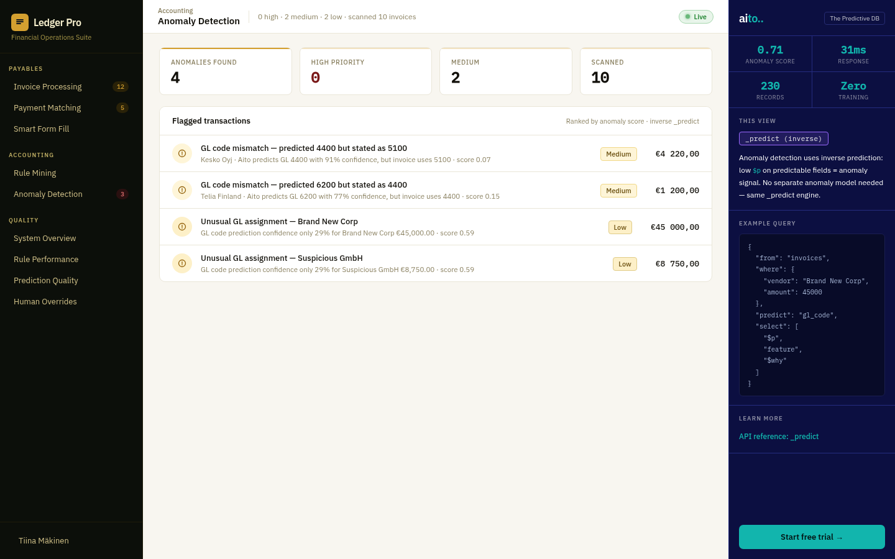

# Anomaly detection — inverse prediction



*Use `_predict` in inverse: for each posted invoice, ask Aito
which GL the model would predict given the other fields. If the
ground-truth GL is not in the top-3, flag it. Low confidence on a
normally-predictable field = anomaly.*

## Overview

Most ML anomaly detection systems train a separate model on
"normal" patterns and score deviations. Aito doesn't need that:
the same `_predict` that does the predictions is also the
likelihood model. Score every posted invoice against its own
prediction; anomalies fall out as low-probability ground-truth.

## How it works

### Score one invoice

```python
# src/anomaly_service.py — scan_invoice()
result = client.predict("invoices",
    {"customer_id": invoice["customer_id"],
     "vendor": invoice["vendor"],
     "amount": invoice["amount"],
     "category": invoice["category"]},
    "gl_code")

predicted = result["hits"][0]["feature"]
predicted_p = result["hits"][0]["$p"]
actual_p = next((h["$p"] for h in result["hits"] if h["feature"] == invoice["gl_code"]), 0)

if actual_p < 0.10 or invoice["gl_code"] not in [h["feature"] for h in result["hits"][:3]]:
    flag(invoice, reason="GL code outside top-3 prediction")
```

### Reasons cluster

The page groups flagged invoices by reason ("GL outside top-3",
"vendor + category mismatch", "amount outlier") so a controller
can review one category at a time instead of one row at a time.

## Demo flow

1. Page shows recent flagged invoices grouped by reason category.
2. Click a flag → expanded view shows the predicted GL (top-3) and
   the actual GL with their respective `$p` so the controller sees
   "Aito would have predicted Office Expenses at 0.91; this was
   booked to Marketing at 0.02".
3. Mark as override → entry lands in `overrides` table → next
   precompute cycle picks it up as a rule candidate (cf. Human
   Overrides view).

## Aito features used

- **`_predict` in scoring mode** — read off the hit list, score the
  ground truth.
- **No separate model file.** Same operator as Invoice Processing,
  same data, just used differently.

## Out of scope

- **Tuning the threshold per customer.** The demo uses a single
  `actual_p < 0.10` cutoff. A real product would learn the
  per-customer noise floor.
- **Time-series anomalies.** Only GL-code anomalies; not "this
  vendor invoiced 10× more than usual this month" (that would need
  a trend query, not `_predict`).
